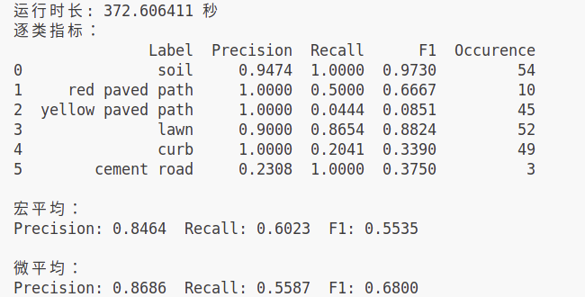

# 30 Days Plan for semantic segmentation

## 0. Questions

- 弱监督语义分割到底怎么用于场景分割，比如自然场景?
- 现在的这个代码在猫啊狗啊的数据集上试一下
- 生成其他种类的弱监督标签试一下
- 一些新的想法，拿VLM先尽可能详细地描述一下，把response传到LLM中，让LLM选择词
- 拿很多张VLM的结果传到LLM中来判断一个视频中出现了哪些地形，受人启发了，这个可能叫做一种思维链?
- 拿视频理解的model理解一个视频中出现了哪些地形
- 我现在想干的这个工作其实就是Open Word Segmentation, 现在虽然做的人并不多，但是也看到有做的了，然后看到有一个人叫做fc-clip的做了60%+的准确率在cityscapes场景下，这个很重要，还是想要复现一下这个方向的工作的
- Deepseek的那个Janus-Pro 7B VLM的描述能力好像很不错
- 看到一个grounded-sam，这个工作可以多了解+关注
- 给大模型生成open vocabulary anno

## 1. How to start

```bash
git clone https://github.com/Tipriest/30Days-for-segmentation.git
git submodule update --init --recursive

# Set Conda Env
conda env create -f environment.yml
conda activate 30daysseg
pip3 install torch torchvision torchaudio --index-url https://download.pytorch.org/whl/cu118
pip install -e .

# Use FCN
cd ./classical_solution/fcn
pip install .
```

## 2. My steps

### 2.1 添加视频material软链接

```bash
cd ./steps/0_material
sudo ln -s /home/tipriest/data/TerrainSeg/hit_grass/videos_record/VID_20220502_135318.mp4 ./original_video.mp4
```

### 2.2 采用FFmpeg提取帧

```bash
# Ubuntu/Debian
sudo apt-get install ffmpeg

# 提取视频帧
mkdir ../1_preprocess/frames
ffmpeg -i original_video.mp4 -vf "fps=5" ../1_preprocess/frames/%06d.jpg

# 提取视频关键帧
python keyframes_select.py


```

### 2.3 采用CLIP进行标注

```bash
pip install git+https://github.com/openai/CLIP.git
```

## 3. Current Results

### 3.1 Open Vocabulary Detection

#### 3.1.1 CLIP Result


#### 3.1.2 llava:13B Result

llava 主要是像是有一点听不懂话一样,让他不要输出这么多，他还非要输出这么多


#### 3.1.3 llava:13B + deepseek:14B Result


#### 3.1.4 qwen_local: result



#### 3.1.4 qwen_with_api: result

